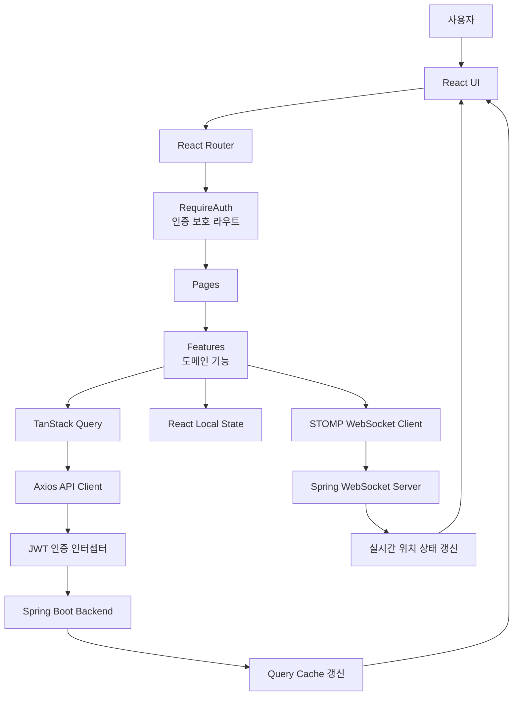
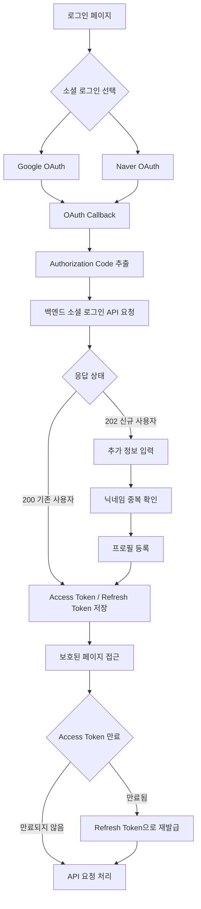
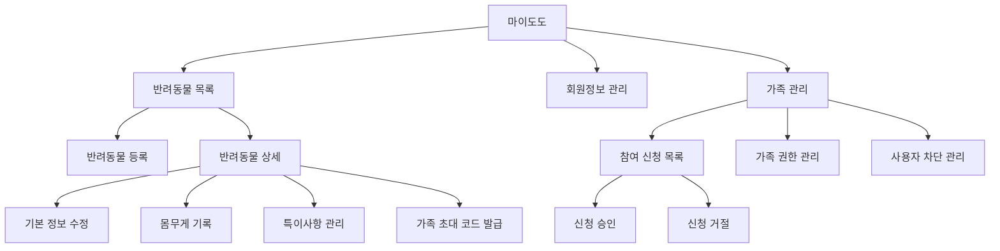
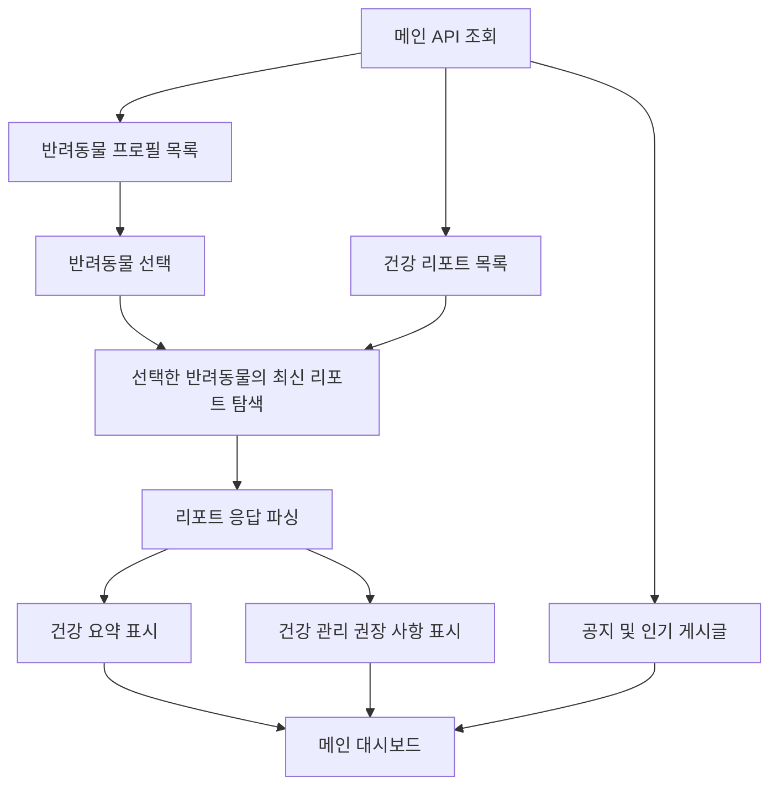
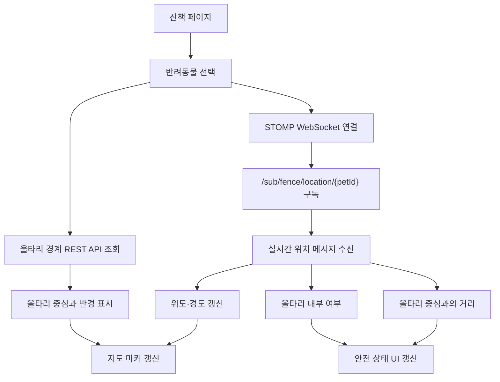
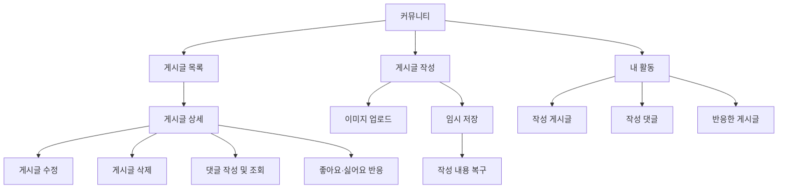
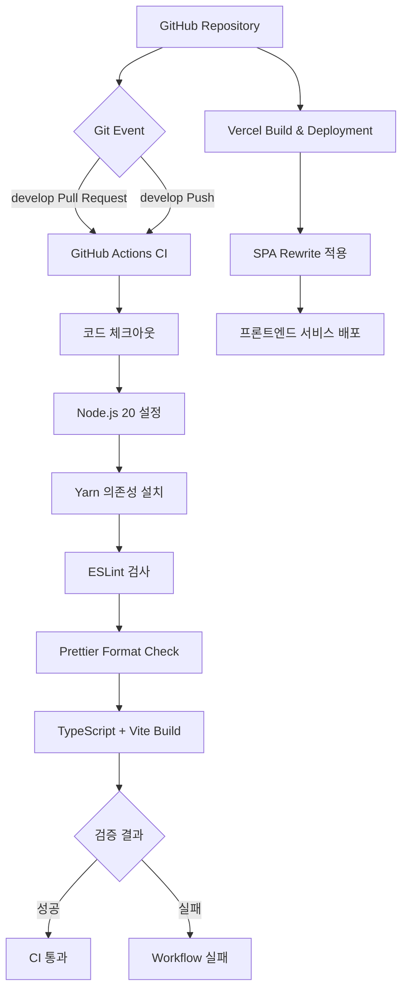

## ✨ 프론트엔드 주요 기능 (Key Frontend Features)

* **✅ 사용자 인증 및 계정 관리**

  > Google/Naver OAuth2 소셜 로그인 및 콜백 처리 <br>
  > 신규 사용자의 추가 정보 입력과 닉네임 중복 확인 <br>
  > Access Token·Refresh Token 기반 로그인 상태 유지 및 토큰 재발급 <br>
  > 로그아웃, 회원정보 수정, 이메일 인증 기반 회원 탈퇴

* **✅ 메인 대시보드 및 AI 건강 리포트**

  > 등록된 반려동물 선택형 메인 대시보드 제공 <br>
  > 반려동물별 최신 AI 건강 리포트와 건강 관리 권장 사항 표시 <br>
  > 반려동물 기본 정보, 몸무게, 검진 일자 등 주요 정보 시각화 <br>
  > 공지사항, 인기 게시글 및 주요 서비스 바로가기 제공

* **✅ 반려동물 및 가족 관리**

  > 반려동물 목록, 등록, 상세 조회, 정보 수정 화면 <br>
  > 반려동물 프로필 이미지 업로드 및 파일 검증 <br>
  > 몸무게 기록과 특이사항 등록·수정·삭제 <br>
  > 가족 초대 코드 발급, 가족 참여 신청 및 권한 관리

* **✅ 산책 및 실시간 위치 추적**

  > 지도 기반 반려동물 현재 위치 및 안전 구역 시각화 <br>
  > STOMP WebSocket을 활용한 실시간 위치 데이터 구독 <br>
  > 울타리 내부·외부 상태와 중심점 기준 거리 표시 <br>
  > 반려동물별 위치 추적과 연결 상태 관리

* **✅ 지오펜스 안전 구역 관리**

  > 반려동물별 안전 구역 생성 및 경계 조회 <br>
  > 울타리 이름, 중심 좌표, 반경 수정 <br>
  > 안전 구역 활성화·비활성화 상태 관리 <br>
  > 서버에서 판정한 울타리 이탈 여부를 실시간 UI에 반영

* **✅ 커뮤니티**

  > 게시글 목록, 상세 조회, 작성, 수정, 삭제 <br>
  > 게시글 이미지 업로드 및 작성 중 임시 저장 <br>
  > 댓글 작성·조회와 좋아요·싫어요 반응 기능 <br>
  > 작성 게시글, 댓글, 반응 등 내 활동 조회

* **✅ 알림 및 사용자 설정**

  > 서비스 알림 수신 여부 설정 <br>
  > 마이도도 메뉴를 통한 사용자 설정 관리 <br>
  > API 처리 상태에 따른 성공·실패 메시지와 사용자 피드백 제공

* **✅ 사용자 경험 및 데이터 처리**

  > TanStack Query 기반 서버 상태 캐싱과 데이터 갱신 <br>
  > 로딩 Skeleton, 오류 화면, 빈 상태 UI 및 재시도 처리 <br>
  > Axios 공통 클라이언트와 인증 인터셉터를 통한 API 요청 관리 <br>
  > 반응형 레이아웃과 모바일·데스크톱 화면 대응

* **✅ 코드 품질 및 배포 환경**

  > ESLint와 Prettier 기반 코드 품질 및 포맷 관리 <br>
  > Husky와 lint-staged를 활용한 커밋 전 자동 검사 <br>
  > GitHub Actions 기반 Lint, Format Check, TypeScript Build 검증 <br>
  > Vercel 기반 프론트엔드 배포 및 SPA Routing 지원

<br>

## ⚙️ 기술 스택 (Tech Stack)

<div align="center">

### Frontend Core

<p>


</p>

### Routing & Server State

<p>


</p>

### Real-time Communication

<p>

</p>

### Code Quality & Deployment

<p>


</p>

</div>

<br>

## 🤖 프론트엔드 아키텍처 (Frontend System Architecture)

DoDo 프론트엔드는 화면, 도메인 기능, 공통 모듈의 책임을 분리한 계층형 구조로 구성되어 있습니다.

사용자의 요청은 React Router를 통해 페이지로 전달되고, 각 페이지는 Feature 계층의 API와 상태 관리 로직을 사용합니다. 서버 데이터는 TanStack Query로 관리하며, Axios와 STOMP WebSocket을 통해 백엔드 서버와 통신합니다.



<br>

## 📁 프로젝트 구조 (Project Structure)

DoDo 프론트엔드는 `app`, `pages`, `features`, `widgets`, `shared` 계층으로 책임을 분리합니다.

```text
📦 src
┣ 📂 app
┃ ┣ 📂 guards             # 인증 여부에 따른 접근 제어
┃ ┣ 📂 layouts            # 앱 및 인증 페이지 공통 레이아웃
┃ ┣ 📂 styles             # 전역 스타일과 디자인 토큰
┃ ┣ 📜 App.tsx            # 애플리케이션 진입 컴포넌트
┃ ┗ 📜 router.tsx         # 전체 페이지 라우팅 설정
┃
┣ 📂 pages
┃ ┣ 📂 auth               # 로그인, OAuth 콜백, 회원가입
┃ ┣ 📂 community          # 커뮤니티 목록, 상세, 작성, 수정, 내 활동
┃ ┣ 📂 family             # 가족 초대 참여
┃ ┣ 📂 main               # 메인 대시보드와 건강 리포트
┃ ┣ 📂 my                 # 사용자, 반려동물, 몸무게, 특이사항 관리
┃ ┣ 📂 walk               # 산책 지도와 실시간 위치 추적
┃ ┗ 📂 not-found          # 404 페이지
┃
┣ 📂 features
┃ ┣ 📂 auth               # 소셜 로그인, 토큰, 사용자 API
┃ ┣ 📂 community          # 게시글, 댓글, 반응 기능
┃ ┣ 📂 family-management  # 반려동물 가족 관리
┃ ┗ 📂 fence              # 울타리와 실시간 위치 관리
┃
┣ 📂 widgets
┃ ┗ 📂 header             # 공통 헤더와 내비게이션
┃
┗ 📂 shared
  ┣ 📂 api                # Axios 클라이언트와 공통 API
  ┣ 📂 assets             # 이미지, 아이콘, SVG 리소스
  ┣ 📂 lib
  ┃ ┣ 📂 api              # API 오류 메시지 처리
  ┃ ┣ 📂 auth             # JWT 저장, 만료 확인, 재발급
  ┃ ┣ 📂 files            # 이미지 업로드 검증
  ┃ ┣ 📂 react-query      # QueryClient와 Query Key
  ┃ ┗ 📂 socket           # STOMP WebSocket 클라이언트
  ┗ 📂 ui                 # 공통 UI 컴포넌트
```

<br>

## 🔐 인증 구조 (Authentication)

DoDo 프론트엔드는 Google과 Naver OAuth2 로그인 및 JWT 기반 인증 구조를 사용합니다.



### 인증 처리 흐름

```text
1. 사용자가 Google 또는 Naver 로그인을 선택합니다.
2. OAuth 인증이 완료되면 프론트엔드 콜백 페이지로 Authorization Code가 전달됩니다.
3. 프론트엔드는 Provider와 Authorization Code를 백엔드에 전달합니다.
4. 기존 회원이면 Access Token과 Refresh Token을 저장합니다.
5. 신규 회원이면 추가 정보 입력과 닉네임 중복 확인을 진행합니다.
6. 보호된 페이지는 RequireAuth를 통해 Access Token 보유 여부를 확인합니다.
7. Access Token이 만료되면 Refresh Token을 사용하여 토큰 재발급을 요청합니다.
8. 재발급에 실패하거나 Refresh Token이 만료되면 로그인 페이지로 이동합니다.
```

<br>

## 🐶 반려동물 및 가족 관리 (Pet & Family Management)

반려동물 프로필과 가족 구성원을 하나의 마이도도 화면에서 관리합니다.



### 제공 기능

| 구분         | 주요 기능                        |
| ---------- | ---------------------------- |
| 반려동물 기본 정보 | 이름, 종, 품종, 성별, 생년월일 등 프로필 관리 |
| 프로필 이미지    | 이미지 선택, 미리보기, 파일 크기 및 확장자 검증 |
| 몸무게 기록     | 날짜별 몸무게 등록, 조회, 수정 및 삭제      |
| 특이사항       | 알레르기, 질환, 복용 약 등 특이사항 관리     |
| 가족 초대      | 초대 코드 생성 및 초대 코드 기반 참여 신청    |
| 가족 권한      | 참여 신청 승인·거절 및 가족 구성원 관리      |

<br>

## 🩺 AI 건강 리포트 (AI Health Report)

메인 화면에서 반려동물을 선택하면 해당 반려동물의 최신 건강 리포트를 확인할 수 있습니다.



### 화면 처리

* 등록된 여러 반려동물 중 조회할 반려동물을 선택할 수 있습니다.
* 선택된 반려동물의 최신 건강 분석 리포트를 표시합니다.
* JSON 형태의 리포트 응답에서 요약 내용과 권장 사항을 분리합니다.
* 데이터 조회 중에는 Skeleton UI를 제공합니다.
* 데이터가 없거나 오류가 발생한 경우 빈 상태 및 재시도 UI를 제공합니다.

<br>

## 📍 실시간 위치 및 지오펜스 (Real-time Location & Geo-fencing)

STOMP WebSocket으로 반려동물의 위치를 구독하고 지도에 실시간으로 반영합니다.



### 울타리 관리 기능

| 기능       | 설명                                     |
| -------- | -------------------------------------- |
| 울타리 생성   | 반려동물, 중심 좌표, 반경, 울타리 이름을 입력하여 안전 구역 생성 |
| 울타리 조회   | 접근 가능한 반려동물의 울타리 경계 목록 조회              |
| 울타리 수정   | 울타리 이름, 중심 좌표 및 반경 수정                  |
| 활성 상태 변경 | 울타리 감지 기능 활성화 및 비활성화                   |
| 실시간 위치   | 반려동물별 WebSocket Topic을 구독하여 현재 위치 표시   |
| 이탈 상태    | 서버가 판정한 울타리 내부·외부 상태를 UI에 표시           |

<br>

## 💬 커뮤니티 (Community)

사용자 간 반려동물 정보와 경험을 공유할 수 있는 커뮤니티 기능을 제공합니다.



### 커뮤니티 데이터

| 구분     | 처리 방식                                     |
| ------ | ----------------------------------------- |
| 게시글 목록 | 페이지 번호와 크기를 전달하여 목록 조회                    |
| 게시글 상세 | 게시글 ID를 기준으로 상세 데이터 조회                    |
| 게시글 작성 | 제목, 내용 및 이미지 URL을 전달하여 등록                 |
| 임시 저장  | Session Key를 Local Storage에 저장하여 작성 내용 복구 |
| 댓글     | 게시글별 댓글 목록 조회 및 댓글 작성                     |
| 반응     | 좋아요·싫어요 상태 변경 후 관련 Query 갱신               |
| 내 활동   | 작성 게시글, 댓글 및 반응 내역 조회                     |

<br>

## 🔄 데이터 및 상태 관리 (Data & State Management)

DoDo 프론트엔드는 별도의 전역 상태 관리 라이브러리 없이 서버 상태와 화면 상태의 성격에 따라 관리 방식을 구분합니다.

| 구분              | 기술                | 역할                              |
| --------------- | ----------------- | ------------------------------- |
| Server State    | TanStack Query    | API 데이터 조회, 캐싱, 재요청 및 Query 무효화 |
| API Client      | Axios             | REST API 요청과 공통 응답 처리           |
| Authentication  | Axios Interceptor | JWT 자동 첨부, 토큰 재발급 및 실패 요청 재시도   |
| Real-time State | STOMP.js          | 실시간 위치 데이터 구독과 연결 상태 관리         |
| Routing         | React Router      | 페이지 라우팅, 동적 경로, 인증 보호 라우트       |
| Local UI State  | React Hooks       | 모달, 입력 폼, 선택 상태 및 화면 상태 관리      |
| Draft Storage   | Local Storage     | 커뮤니티 임시 저장 Session Key 관리       |

<br>

## 🚀 CI 및 배포 구조 (CI & Deployment)

DoDo 프론트엔드는 GitHub Actions를 통해 코드 품질과 빌드 가능 여부를 검증하고, Vercel 환경에서 서비스를 배포합니다.



### CI 검증 과정

```text
1. develop 브랜치 Pull Request 또는 Push 시 Workflow가 실행됩니다.
2. Node.js 20과 Yarn 1.22.22 환경을 설정합니다.
3. yarn install --frozen-lockfile 명령으로 의존성을 설치합니다.
4. ESLint를 통해 코드 오류와 규칙 위반을 검사합니다.
5. Prettier를 통해 코드 포맷을 검사합니다.
6. TypeScript 컴파일과 Vite Production Build를 실행합니다.
7. 모든 과정이 성공해야 CI 검증을 통과합니다.
```

### 환경 변수

| 환경 변수               | 설명                           |
| ------------------- | ---------------------------- |
| `VITE_API_BASE_URL` | Spring Boot 백엔드 API 서버 기본 주소 |

<br>

## 🤝 Conventions

우리 프로젝트는 원활한 협업을 위해 아래와 같은 규칙을 따릅니다.

* **[Commit Convention](./.github/COMMIT_CONVENTION.md)**

<br>

## 📊 프론트엔드 참고자료 출처 (Reference)

👉🏻 **[React 공식 문서](https://react.dev/)**
👉🏻 **[TypeScript 공식 문서](https://www.typescriptlang.org/docs/)**
👉🏻 **[Vite 공식 문서](https://vite.dev/guide/)**
👉🏻 **[Tailwind CSS 공식 문서](https://tailwindcss.com/docs)**
👉🏻 **[React Router 공식 문서](https://reactrouter.com/)**
👉🏻 **[TanStack Query 공식 문서](https://tanstack.com/query/latest/docs/framework/react/overview)**
👉🏻 **[Axios 공식 문서](https://axios-http.com/docs/intro)**
👉🏻 **[STOMP.js 공식 문서](https://stomp-js.github.io/guide/stompjs/using-stompjs-v5.html)**
👉🏻 **[Vercel 공식 문서](https://vercel.com/docs)**

<br>

## 💁‍♂️ 팀원 소개 (Team Members)

<table align="center">
  <tr>
    <td align="center">
      <a href="https://github.com/sooloin">
        <br>
        <b>조수빈</b>
      </a>
    </td>
  </tr>
</table>
